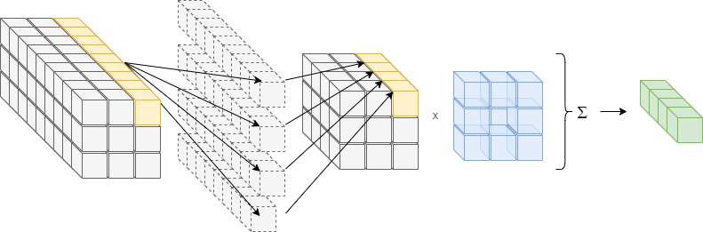
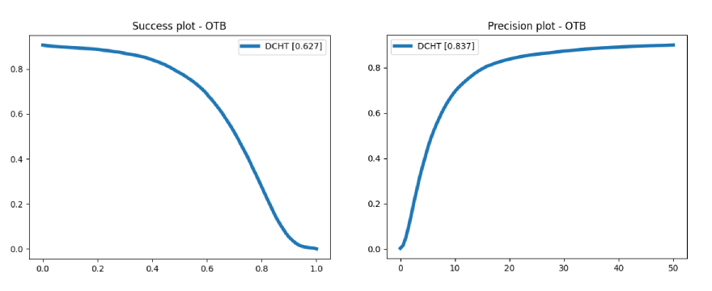

# DCHT: Dense Convolutional Histogram-based Tracking

Tracking with histograms of convolutional features.


Tested on Python 3.7, Install requirements as:
```shell
pip install -r requirements.txt
```

## Pretrained models

A pretrained model is available achieving the following performance on OTB2015:



Backbone weights pretrained on ImageNet are also available as starting weights when training a 
new model.

## Training

Training is handled by the `train.py` script:
```shell
python train.py -h
```
```
usage: train.py [-h] [--epochs EPOCHS] [--batch-size BATCH_SIZE] [--num-workers NUM_WORKERS] [--log-freq LOG_FREQ] [--device DEVICE] [--lr LR] [--weight-decay WEIGHT_DECAY] [--data-root DATA_ROOT]

optional arguments:
  -h, --help            show this help message and exit
  --epochs EPOCHS       Number of training epochs.
  --batch-size BATCH_SIZE
                        Batch size for training.
  --num-workers NUM_WORKERS
                        Number of threads used for data loading.
  --log-freq LOG_FREQ   Logging frequency (iterations)
  --device DEVICE       Device used for training
  --lr LR               Initial learning rate.
  --weight-decay WEIGHT_DECAY
                        Weight decay rate.
  --data-root DATA_ROOT
                        Dataset root path.
```

By default, the COCO detection dataset is used for training, but the following datasets 
are available as training sets:
- COCO Detection
- TrackingNet
- ImageNet VID
- VisDrone2018SOT
- VisDrone2018MOT

## Inference

The following datasets are available for testing:
- VOT2014, VOT2015, VOT2016, VOT2017
- UAV123
- OTB2015 [[download + preparation](data/README.md)]

The validation set from [CFNet](https://github.com/bertinetto/cfnet) is also supported 
via the VOT dataset class.

Testing is handled by the `test.py` script:
```shell
python test.py -h
```
```
usage: test.py [-h] [--device DEVICE] [--weights WEIGHTS] [--data-type {uav123,uav20l,vot,otb}] [--data-root DATA_ROOT] [--show] [--write-mat]

optional arguments:
  -h, --help            show this help message and exit
  --device DEVICE       Device used for testing.
  --weights WEIGHTS     Path to model weights.
  --data-type {uav123,uav20l,vot,otb}
                        Dataset type.
  --data-root DATA_ROOT
                        Dataset root path.
  --show                Visualize result.
  --write-mat           Write result to mat file to be read by benchmark toolkits.
```

The result can be saved to .mat files to be used in benchmark toolkits for comparison with other
trackers.
**IMPORTANT**: the evaluation performed by this code as notable differences to the evaluation 
performed by the OTB/UAV123 MATLAB toolkit and the results are mostly indicative.

## Citation

```
@article{nousi2020dense,
  title={Dense convolutional feature histograms for robust visual object tracking},
  author={Nousi, Paraskevi and Tefas, Anastasios and Pitas, Ioannis},
  journal={Image and Vision Computing},
  volume={99},
  pages={103933},
  year={2020},
  publisher={Elsevier}
}
```
